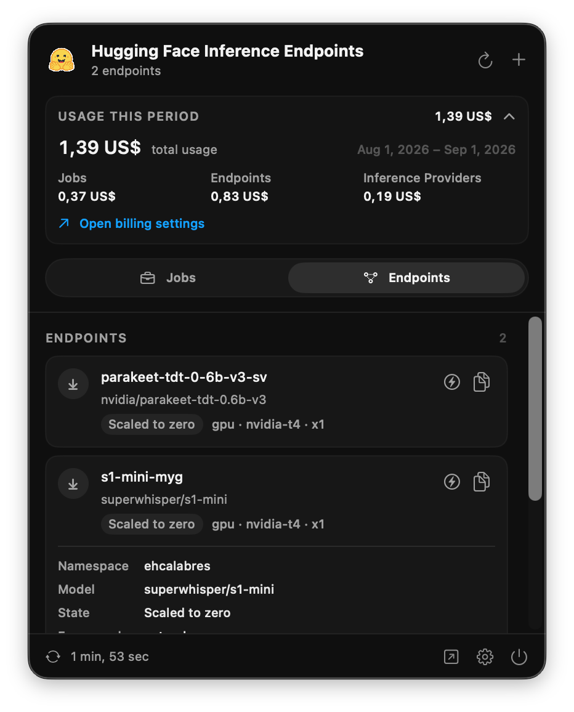

  

<h1 align="center">Hugging Face for macOS</h1>

  A native menu bar companion for keeping an eye on Hugging Face Jobs, Inference Endpoints, and usage.

## Features

- Monitor active and scheduled Jobs, including logs and controls.
- View Inference Endpoints and their current state.
- Track billing usage across Jobs, Endpoints, and Inference Providers.
- Refresh automatically while keeping your Hugging Face token in Keychain.

## Getting started

1. Open `Hugging Face MacOS.xcodeproj` in Xcode.
2. Build and run the **Hugging Face** scheme on macOS 26.5 or later.
3. Open Settings and add a Hugging Face token with access to the namespace you want to monitor.
